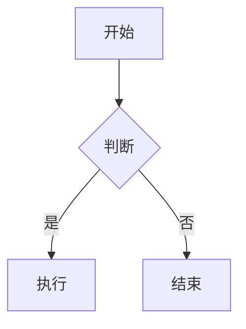

# 快速开始指南

## 🚀 一键启动

```bash
cd web_test
./start-server.sh
```

然后访问: **http://localhost:8000**

---

## 📂 项目结构

```
web_test/
├── index.html              # 主页面
├── css/
│   └── style.css          # 完整样式 (540+ 行)
├── js/
│   ├── markdown-renderer.js  # 渲染引擎 (244 行)
│   ├── test-data.js         # 测试数据 (400+ 行)
│   └── main.js              # 主逻辑 (130 行)
├── README.md               # 项目说明
├── IMPLEMENTATION.md       # 实现对照文档
└── start-server.sh         # 启动脚本
```

---

## 🎨 主要功能

### 1️⃣ 代码高亮

**支持语言**: Python, JavaScript, TypeScript, Java, C#, Go, Rust, Ruby, PHP, SQL, Bash, HTML, CSS, JSON, YAML, Markdown...

**示例**:
````markdown
```python
def hello(name):
    print(f"Hello, {name}!")
```
````

**功能**:
- ✅ 折叠/展开
- ✅ 复制代码
- ✅ 语法高亮
- ✅ 主题适配

---

### 2️⃣ 表格渲染

**示例**:
```markdown
| 列1 | 列2 | 列3 |
|-----|:---:|----:|
| 左对齐 | 居中 | 右对齐 |
```

**特性**:
- ✅ 自动对齐
- ✅ 内部边框
- ✅ 表头背景
- ✅ 横向滚动

---

### 3️⃣ Mermaid 图表

**支持类型**:
- 流程图 (`graph`, `flowchart`)
- 时序图 (`sequenceDiagram`)
- 甘特图 (`gantt`)
- 状态图 (`stateDiagram`)
- 类图 (`classDiagram`)
- 饼图 (`pie`)
- ER 图 (`erDiagram`)

**示例**:
````markdown

````

---

### 4️⃣ 数学公式

**行内公式**: `$E = mc^2$`

**块级公式**:
```markdown
$$
\int_0^1 x^2 dx = \frac{1}{3}
$$
```

**支持**:
- ✅ 分数、根号、求和
- ✅ 矩阵
- ✅ 希腊字母
- ✅ 积分、导数

---

## 🎯 测试数据

页面自动加载 6 个测试消息:

1. **基础 Markdown** - 标题、列表、引用、链接
2. **代码示例** - Python, JavaScript, SQL, Bash, HTML
3. **表格** - 产品对比、语言特性、项目进度
4. **Mermaid** - 流程图、时序图、甘特图、状态图、类图
5. **数学公式** - 欧拉公式、傅里叶变换、麦克斯韦方程组
6. **综合场景** - Web 应用架构设计 (包含所有上述元素)

---

## 🌓 主题切换

点击右上角 **"🌙 切换主题"** 按钮

- **亮色主题**: GitHub 风格
- **暗色主题**: Atom One Dark 风格

主题设置自动保存到 `localStorage`

---

## 🔧 自定义配置

### 修改主题颜色

编辑 `css/style.css`:

```css
:root {
    --primary: #2563eb;  /* 主色调 */
    --bg-primary: #ffffff;  /* 背景色 */
    --text-primary: #1a1a1a;  /* 文字色 */
}
```

### 添加自定义测试数据

编辑 `js/test-data.js`:

```javascript
{
    id: 7,
    assistant: 'Custom Bot',
    timestamp: new Date().toLocaleString('zh-CN'),
    content: `# 你的 Markdown 内容`
}
```

---

## 📊 性能指标

- **首次加载**: < 1s
- **Markdown 渲染**: < 100ms
- **代码高亮**: < 50ms/块
- **Mermaid 渲染**: < 500ms/图
- **页面大小**: ~80KB (未压缩)

---

## 🐛 常见问题

### Q: Mermaid 图表不显示?

**A**: 检查浏览器控制台,确保 CDN 正常加载。可以替换为本地库:

```html
<script src="./assets/mermaid.min.js"></script>
```

### Q: 代码高亮主题不生效?

**A**: 确保切换主题时同时切换了 Highlight.js 的 CSS:

```javascript
// 亮色主题
document.getElementById('highlight-light').removeAttribute('disabled');
document.getElementById('highlight-dark').setAttribute('disabled', 'disabled');
```

### Q: 数学公式渲染错误?

**A**: 检查 LaTeX 语法是否正确,可以在 [KaTeX 文档](https://katex.org/) 中查找支持的命令。

---

## 🔗 参考资源

- **Marked.js 文档**: https://marked.js.org/
- **Highlight.js 语言列表**: https://highlightjs.org/static/demo/
- **Mermaid 语法**: https://mermaid.js.org/
- **KaTeX 支持的函数**: https://katex.org/docs/supported.html

---

## 📝 TODO

- [ ] 添加图片预览功能
- [ ] 添加引用点击跳转
- [ ] 添加消息导出功能 (PDF/Markdown)
- [ ] 添加代码运行功能 (沙箱)
- [ ] 优化移动端体验

---

**Enjoy! 🎉**
